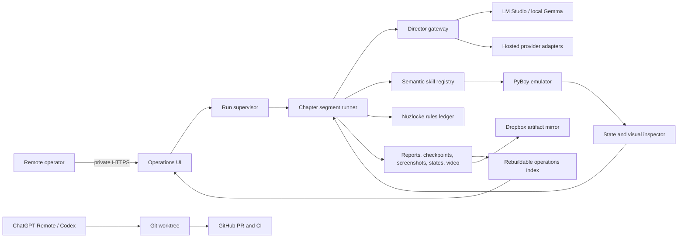

# Implementation Plan: Remote-Supervised Full-Game Nuzlocke

Status: proposed v1
Last updated: 2026-08-20

## Outcome

Build a provider-independent, LLM-directed Pokemon Red player that can start from a clean ROM boot, complete a configurable Nuzlocke through the Hall of Fame, narrate and explain its decisions for a stream, recover from ordinary failures without human control, and expose enough live evidence for remote oversight.

Completion means all of the following are true:

- The run begins from a clean, reproducible game state and reaches the Hall of Fame without human gameplay input.
- The LLM Director owns strategy and chooses semantic skills; deterministic code owns emulator mechanics, verification, Nuzlocke legality, and safety.
- A run can survive process restarts by resuming from the last safe checkpoint.
- The Director provider and model can be changed through configuration without changing chapter logic, skill code, reports, or the lab UI.
- Local Gemma remains the default hardening target, but no architecture or chapter policy assumes Gemma is the production model.
- The operator can observe progress, review evidence, pause or stop safely, and answer rare artifact requests from a phone.
- Stream narration, overlays, and chat directives remain grounded in actual game state.

## Current Baseline

The project has already demonstrated the central architecture rather than merely scaffolding it:

- The test baseline is 335 passing tests with one SDL dependency warning.
- The latest healthy unattended run progressed from early-game state through the Spearow and Pikachu catches into the Chapter 7 Brock-training objective.
- Bounded run reports include Director choices, reasoning, skill results, final state, screenshots, video metadata, and checkpoint verdicts.
- Action-budget exhaustion is correctly treated as an inspection checkpoint.
- Eleven of nineteen promotion surfaces are verified; five are candidates and three remain needed.
- The Director can use semantic battle, dialogue, catching, healing, purchase, party, and regional-navigation skills.
- Videos are already rendered and copied into the Dropbox sync folder.

The largest gaps are now operability and scale:

- There are two LLM execution paths: a Python OpenAI-compatible local runner and an OpenAI-specific TypeScript browser route. They can drift in prompting, tool schemas, and policy.
- The unattended runner performs one segment but no durable supervisor automatically continues healthy checkpoints.
- The lab UI is coupled directly to local files and a localhost sidecar, with no authenticated remote operations layer.
- `chapter_direction.py` is a hard-coded decision tree that currently ends at Brock.
- `skill_execution.py` is a 7,000-line integration surface that will become difficult to extend across the whole game.
- At least 167 committed metadata files contain machine-specific absolute paths. The current directory junction is a compatibility shim, not a portable solution.
- The repository has no CI workflow yet.
- Nuzlocke rules, encounter ownership, deaths, and clauses are not represented as a first-class durable ledger.

## Architecture Revision

The next phase should consolidate the existing work into one canonical runtime instead of extending both Director paths independently.

The immutable report, event, state, and media bundle remains the research source of truth. A local SQLite database may index those artifacts for fast UI queries, but it must be rebuildable and must not contain unique run state.

## Operating Principles

1. Preserve Director agency. Chapter briefs state objectives, facts, risks, and success conditions; they do not encode a walkthrough.
2. Treat local Gemma as an adversarial readability test. Weak-model failures should improve schemas, observations, and skills before they produce deterministic strategy patches.
3. Keep Nuzlocke legality deterministic. The Director may choose strategy inside the rules, but it may not reinterpret deaths, encounter eligibility, or configured clauses.
4. Make every long run a chain of short, inspectable segments. A healthy checkpoint continues automatically; unsafe state stops or rolls back.
5. Separate development control from gameplay control. ChatGPT Remote oversees Codex work; the Operations UI oversees emulator runs.
6. Keep the emulator sidecar bound to localhost. Only the authenticated Operations UI is exposed through the private access layer.
7. Make human review asynchronous. The supervisor queues compact review bundles and continues safe adjacent work whenever possible.
8. Add learned options only for a measured recurring execution failure. Do not introduce a broad learned policy on the critical path.

## Tooling Stack

### Development oversight

- ChatGPT Remote on mobile for Codex tasks, worktrees, durable goals, approvals, steering, notifications, and diff review.
- GitHub for the canonical repository, feature branches, pull requests, issues, and CI results.
- One Git worktree per substantial implementation slice so unattended Codex work cannot destabilize the active gameplay checkout.

### Gameplay oversight

- A project-owned Operations UI, evolved from the current lab UI.
- Tailscale Serve as the initial private HTTPS reverse proxy to the localhost UI. Do not use a public tunnel for the first operating version.
- Dropbox as the large-artifact mirror for segment videos and review bundles. Runtime reports should record artifact identity and upload/sync status, not assume a particular local drive letter.
- Windows Task Scheduler initially, or a Windows service wrapper later, to start the supervisor at boot and restart it after crashes.
- An optional generic notification webhook for chapter completion, unsafe checkpoints, repeated model failures, and artifact requests. The dashboard remains the source of truth.
- OBS integration only after the gameplay runtime is reliable; rendered diagnostic video and live stream capture serve different purposes.

## Milestones

### Milestone 0: Portable, Reviewable Engineering Baseline

Purpose: make the repository safe for worktrees, CI, and remote Codex development.

Work:

- Replace committed absolute paths with repo-relative artifact identifiers and a central path resolver.
- Preserve compatibility with existing local captures and reports through a migration or fallback resolver.
- Add Windows-friendly developer commands for unit tests, UI typecheck/build, report validation, and artifact audits.
- Add GitHub Actions for ROM-free Python tests, TypeScript typecheck/build, and secret/path hygiene.
- Document which integration tests require the local ROM, save states, LM Studio, SDL, or GPU.
- Add schema-version and migration tests for durable reports and metadata.

Gate:

- A fresh clone passes all ROM-free checks without the directory junction.
- CI is green on `main`.
- No committed path names the operator or a local drive.
- The ROM, saves, credentials, videos, and generated artifacts remain excluded.

Human burden: review one migration summary and a sample of rewritten metadata.

### Milestone 1: Remote Operations MVP

Purpose: let the operator watch useful progress before more autonomous work is attempted.

Work:

- Add a single project launcher for the UI, sidecar, and supervisor health endpoint.
- Create a read-mostly Operations page showing service health, current run, chapter, goal, current screenshot, party, inventory, last Director decision, last skill result, checkpoint verdict, and artifact links.
- Add run history, chapter timeline, failure summaries, and a deferred review queue.
- Add safe `pause`, `resume`, `stop-after-action`, and `emergency-stop` controls with an audit event for every command.
- Keep raw button controls confined to explicit diagnostic capture mode.
- Configure private remote access and verify the phone workflow.
- Surface Dropbox sync/upload status and playable segment links when available.

Gate:

- The operator can observe and safely pause a local test run from a phone without remote desktop access.
- No API key, ROM path, raw model payload secret, or unrestricted filesystem path is exposed.
- Loss of the remote connection does not stop or corrupt the local run.

Human burden: one phone acceptance test.

### Milestone 2: Canonical Provider-Neutral Director Runtime

Purpose: remove Gemma and OpenAI coupling from core execution.

Work:

- Define canonical `DirectorRequest`, `DirectorDecision`, `ToolCall`, `ProviderUsage`, and `DirectorError` contracts.
- Create provider capability flags for images, structured tools, reasoning controls, streaming, and usage accounting.
- Implement an OpenAI-compatible Chat Completions adapter for LM Studio/local Gemma.
- Implement the existing OpenAI Responses behavior as a separate hosted adapter.
- Add a deterministic fake/replay adapter for tests.
- Move Director prompt construction, tool schemas, history truncation, response normalization, and retries into the Python runtime.
- Turn the current TypeScript `/api/llm-player` route into a thin client of the canonical runtime.
- Rename the canonical executable to provider-neutral language such as `run_chapter_segment.py`; retain the Gemma command as a compatibility wrapper.
- Record provider, model, capabilities, latency, token usage, and estimated cost when known. Never record credentials.

Gate:

- The same frozen scenario and semantic tool registry run through local Gemma and one hosted adapter without chapter or skill changes.
- Both adapters emit the same report schema and normalized error categories.
- A provider failure cannot leave the emulator in an unknown partially-executed action.

Human burden: choose the first hosted comparison provider only when the adapter and eval harness are ready. This does not select the eventual stream model.

### Milestone 3: Durable Segment Supervisor

Purpose: turn healthy bounded runs into an unattended progression loop.

Work:

- Implement a supervisor state machine: `idle`, `starting`, `running`, `checkpointing`, `waiting_review`, `paused`, `blocked`, `completed`, and `failed`.
- Launch one bounded segment from the last safe state and atomically register its artifacts.
- Automatically continue `healthy_continue` and allowed `provisional_continue` checkpoints from `finalState`.
- Retry a model error once after a provider health check; quarantine repeated model failures without losing the checkpoint.
- Roll back `unsafe_state`; preserve and queue `stalled_loop`, `skill_gap`, and `state_interpretation_gap` evidence.
- Add process leases, heartbeat files, atomic manifest writes, crash recovery, disk-space checks, and an operator stop file.
- Improve checkpoint classification with progress deltas, repeated state hashes, chapter movement, resource changes, literal-button frequency, and failure clustering.
- Bundle each segment's report, checkpoint, final state, screenshot, and video into a stable artifact manifest.

Gate:

- An eight-hour soak test survives normal action-budget checkpoints and at least one forced supervisor restart.
- No segment runs twice concurrently against the same save lineage.
- Every stop has a stable final checkpoint and a machine-readable reason.
- At least 95% of sampled failed/stalled segments are diagnosable from artifacts without watching the full video.

Human burden: review a sample of checkpoint decisions, not every segment.

### Milestone 4: Configurable Nuzlocke Contract

Purpose: make the actual target rules enforceable and stream-legible.

Work:

- Define a versioned ruleset covering first encounter per area, fainting/death, nicknames, duplicate and shiny clauses, gift/static encounters, level caps, item restrictions, battle style, blackout policy, and reset policy.
- Build a durable lineage ledger for encounter eligibility, captures, deaths, party/box status, badges, and rule exceptions.
- Reconcile the ledger against RAM/state observations at every checkpoint.
- Add deterministic guards that prevent use of dead Pokemon and illegal extra encounters.
- Distinguish hard rule violations from strategic risk and from model mistakes.
- Expose the ruleset, encounter ledger, deaths, and next eligible areas in Director context and the Operations UI.
- Add synthetic and captured fixtures for catches, failed first encounters, duplicates, gifts, deaths, full-party transfers, and blackouts.

Gate:

- The ledger reconstructs the same Nuzlocke history from a replayed run.
- Illegal encounter and dead-Pokemon actions are blocked before emulator input.
- Ruleset decisions are visible and explainable in reports and overlays.
- The exact stream rules can be changed by configuration rather than code.

Human burden: approve one ruleset configuration before production rehearsals; development can use a documented default.

### Milestone 5: Early-Game Reliability Gate Through Brock

Purpose: convert the existing promising run into a repeatable foundation.

Work:

- Finish the candidate/needed P0 surfaces that recur in actual failures: visual text/menu classification, post-catch/Pokedex flow, nickname handling, blackout detection, and stuckness/progress signals.
- Remove ordinary reliance on `literal_button_press` by turning repeated cases into semantic dialogue or recovery coverage.
- Complete battle outcome branches for XP, level-up, move learning, optional/forced switches, evolution, and post-catch flow.
- Stabilize healing, training, Pewter navigation, gym entry, Brock battle, and post-badge verification.
- Run seeded tuning and held-out suites from clean boot and chapter starts.

Gate:

- Capsule A reaches at least the existing 80% held-out target.
- Clean boot through Boulder Badge reaches at least 70% success on a frozen held-out set.
- Destructive or Nuzlocke-illegal action rate is 0%.
- At least 95% of failures receive a useful category and checkpoint bundle.
- No human gameplay intervention occurs during evaluation.

Human burden: sampled success/failure review under five minutes per selected run.

### Milestone 6: Data-Driven Chapters and General Navigation

Purpose: make full-game expansion additive rather than another hard-coded tree.

Work:

- Replace the monolithic chapter decision tree with a registry of chapter briefs, state predicates, allowed regions, success checks, invariants, and skill families.
- Keep evaluators in code where typed logic is required; keep objectives and policy-neutral guidance in versioned data.
- Extract a map/warp graph from trusted PRET data and combine it with local collision, trainer, warp, and dynamic-object observations.
- Build hierarchical navigation: world route, map route, local correction, interaction, and recovery.
- Incrementally split `skill_execution.py` by domain while preserving the public skill/result contract.
- Add chapters 8-10: Route 3, Mt. Moon/fossil, Cerulean/Misty.

Gate:

- Adding a chapter does not require modifying the central Director loop.
- The same navigation interfaces operate across outdoor routes, buildings, gates, gyms, and a multi-floor dungeon.
- Cerulean/Misty reaches the existing 70% held-out target.

Human burden: collect only promotion evidence the agent cannot safely generate or reach. Every request must name the exact state, why it is needed, and the automatic capture procedure.

### Milestone 7: Full-Game Capability and Chapter Expansion

Purpose: extend the proven runtime to the Hall of Fame in bounded arcs.

Suggested arc order:

1. Bill, Cerulean rival, and route exits.
2. Vermilion, S.S. Anne, Cut, and Lt. Surge.
3. Rock Tunnel and Lavender arrival.
4. Celadon, Erika, and Rocket Hideout.
5. Pokemon Tower, Saffron, Silph Co., and Sabrina.
6. Fuchsia, Safari Zone, Surf, and Koga.
7. Sea routes, Cinnabar, Mansion, and Blaine.
8. Viridian Gym and Giovanni.
9. Route 22 rival, Victory Road, Elite Four, and Champion.

Cross-cutting capabilities to add only when their first arc requires them:

- PC box deposit/withdrawal and full-party catch handling.
- Move learning, replacement, TM/HM use, and field moves.
- Key-item and story-object interactions.
- Multi-floor dungeon navigation, elevators, switches, boulders, and teleport pads.
- Trainer/boss battle planning, status recovery, PP management, shopping, and level-cap awareness.
- Encounter-area mapping and Nuzlocke eligibility across every route and interior.

For each arc:

1. Promote the minimum state facts.
2. Author valid starts, success checks, invariants, and a small holdout set.
3. Implement or extend semantic skills.
4. Run short deterministic and model-driven slices.
5. Harden with local Gemma.
6. Pass the arc gate before joining it to the continuous run.

Gate:

- Each chapter passes its frozen capsule threshold before being added to the continuous lineage.
- Joined runs can resume across every badge and major dungeon boundary.
- Human control remains unnecessary; review remains asynchronous.

Human burden: one compact review batch per new gameplay system, plus rare targeted captures.

### Milestone 8: Production Model Bake-Off

Purpose: choose a stream model from evidence without weakening the local hardening track.

Work:

- Freeze a representative evaluation suite spanning exploration, battle strategy, recovery, resource management, Nuzlocke risk, narration, and help-seeking.
- Compare eligible provider/model profiles on identical checkpoints.
- Measure tool-call validity, strategic decision quality, success rate, recovery quality, narration grounding, latency, token use, and cost.
- Preserve local Gemma as a regression and schema-legibility lane.
- Define production fallback behavior for provider outage, throttling, malformed output, and context growth.

Gate:

- A production profile is selected from recorded results.
- A fallback profile can continue from a checkpoint without schema changes.
- Expected full-run cost and rate-limit exposure are documented before a stream run.

Human burden: approve the cost/quality tradeoff after reviewing the bake-off summary.

### Milestone 9: Stream Interaction and Presentation

Purpose: add entertainment and audience input without destabilizing gameplay.

Work:

- Add a stream adapter that normalizes chat messages independently of Twitch or YouTube provider specifics.
- Implement directive batching, cooldowns, voting, nickname suggestions, moderation, and safe command classes.
- Route accepted suggestions through the existing directive harness and Nuzlocke rules engine.
- Produce grounded narration events from state changes and Director decisions.
- Add an OBS-facing overlay feed for chapter, goal, party, encounter eligibility, deaths, last decision, and review-safe explanations.
- Keep operator pause, emergency stop, and provider fallback outside chat control.

Gate:

- Synthetic chat bursts do not reduce capsule success below the frozen tolerance.
- Destructive and rule-violating chat instructions are rejected at near-100% rates.
- Narration and overlay facts agree with the run ledger and current state.

Human burden: approve moderation policy, persona boundaries, and allowed directive classes.

### Milestone 10: Full-Run Qualification

Purpose: prove the system is ready for an announced stream.

Work and gates:

- Complete at least three fresh-start, full-game Nuzlocke rehearsals with no human gameplay input.
- Complete one rehearsal with the exact production provider, stream layout, chat simulation, and artifact/notification configuration.
- Demonstrate restart recovery, provider fallback, disk-pressure handling, and emergency stop.
- Verify zero illegal uses of dead Pokemon, zero duplicate encounter violations outside configured clauses, and zero unclassified destructive actions.
- Produce a post-run package containing the save lineage, Nuzlocke ledger, chapter timeline, Director audit, failures/recoveries, videos, and cost/latency summary.

## Remote Development Workflow

Use one durable Codex goal for the currently accepted milestone, not for the entire multi-month project. Each implementation slice should follow this loop:

1. Create a fresh worktree from `main`.
2. Restate the milestone gate and the exact slice being changed.
3. Let Codex implement, test, and produce a compact evidence summary.
4. Review the diff and test evidence remotely.
5. Merge only after CI and relevant local integration checks pass.
6. Run a bounded gameplay experiment from a known state.
7. Let the supervisor classify and publish the checkpoint.
8. Convert recurring failures into an issue, promotion candidate, fixture, or next worktree task.

Codex may continue adjacent safe work while review is pending. It should request human gameplay artifacts only after it has exhausted existing captures, generated states, autonomous navigation, and source-backed promotion options.

## Immediate Work Queue

The first implementation sequence should be:

1. Portable-path migration and CI.
2. Read-only Operations page and project health/launcher contract.
3. Private phone access to the Operations page.
4. Provider-neutral Director contracts and adapters.
5. Durable supervisor with automatic checkpoint continuation.
6. Nuzlocke ruleset and ledger.
7. Early-game boot-to-Brock reliability suite.

Do not start broad chapter expansion, public stream integration, or production-model selection before items 1-6 exist. Those foundations directly reduce the amount of unattended work that disappears into videos nobody can efficiently diagnose.

## Decisions Deferred Deliberately

- Production LLM provider and model.
- Exact stream platform.
- Exact Nuzlocke clauses and level-cap policy.
- Notification provider.
- Whether a self-hosted GitHub runner is worth the security and maintenance burden.
- Whether any learned option beyond the narrow battle-menu experiment is justified.

These choices are configuration or evidence decisions. None should block the immediate foundation work.

## Reference Links

- [OpenAI: Mastering remote engineering work from your phone](https://learn.chatgpt.com/blog/mastering-codex-remote-for-engineering)
- [Tailscale Serve documentation](https://tailscale.com/docs/reference/tailscale-cli/serve)
- [GitHub Actions: Store and share workflow artifacts](https://docs.github.com/en/actions/tutorials/store-and-share-data)
